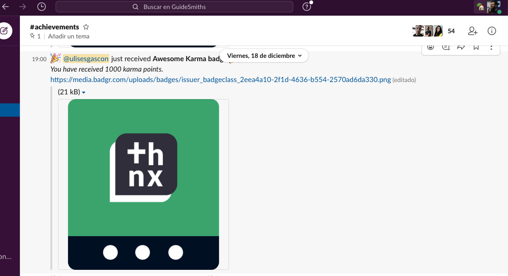

# Open Badges!

This firebase project can help to notify Slack about changes in your [Badgr.io issuer](https://api.badgr.io/docs/v2/)

Main features:

- Keep a record in Realtime Database for all the badges
- Send slack notifications in public channels when a new badge is created
- Send slack notifications when a badge has been granted to an user (including mention)
- Generates all the tokens needed for authentication against the Badgr API.

### Cool notifications in Slack




## Current Architecture


## Documentation

### Environments

_Blaze plan must be enabled for Slack notifications (external http traffic)_

## Dependencies

### Production

- `email-validator@^2.0.4`
- `firebase-admin@^8.0.0`
- `firebase-functions@^3.1.0`
- `request@^2.88.0`
- `request-promise@^4.2.4`

### Development (only)

- `firebase-functions-test@^0.1.6`
- `jest@^24.9.0`
- `nock@^11.3.5`
- `standard@^14.3.1`

### Cloud services

- Firebase Functions
- Firebase Realtime Database

## Database

We are using [Firebase Realtime Database](https://firebase.google.com/products/realtime-database/)

### Rules

Only the Firebase Functions are capable of read/write Database content. Rules applied are in [./database.rules.json](/database.rules.json) as follow:

```json
{
  "rules": {
    ".read": false,
    ".write": false
  }
}
```

### Important

- The `userId` is generated by apply base64 for user's email address.
- The `badgeId` is provided by Badgr API

### Tokens Structure

Path: `/secrets/badgr`
Content:

```json
{
  "access_token" : "-----TOKEN-------",
  "expires_in" : 86400,
  "refresh_token" : "-----ANOTHER_TOKEN-------",
  "scope" : "rw:profile rw:issuer rw:backpack",
  "token_type" : "Bearer"
}
```

### User and user badges Structure

Path: `/data/users/{userId}` and `/data/users/{userId}/badges/{badgeId}`
Content:

```json
{
  "badges" : {
    "EHLRWpv2TW6_6h7zDLrUiA" : {
      "createdAt" : "2019-09-09T14:20:12Z",
      "createdBy" : "mAtias97RKyJkoBPNMRCcQ",
      "criteriaNarrative" : "You are part of Narnia!",
      "criteriaUrl" : "https://website.com",
      "description" : "You are part of the Narnia",
      "entityId" : "EHLRWpv2TW6_6h7zDLrUiA",
      "entityType" : "BadgeClass",
      "image" : "https://cdn.shopify.com/s/files/1/2558/1542/collections/NARNIA_1200x1200.png",
      "issuedOn" : "2019-09-25T07:51:07.170971Z",
      "issuer" : "ltDx80asQoOHgNwT0sdfWg",
      "issuerOpenBadgeId" : "https://api.badgr.io/public/issuers/ltDx80nBQoOHgNwT0FLfWg",
      "name" : "Narnia Membership!",
      "openBadgeId" : "https://api.badgr.io/public/badges/EHLRWpv2TW6_6h7zDLrUiA",
      "revoked" : false,
      "tags" : ["membership", "culture" ]
    }
  },
  "bambooPersonID" : "2",
  "bambooSupervisorID" : "1",
  "department" : "Magic Team",
  "email" : "jane.doe@email.com",
  "jobTitle" : "Senior Developer",
  "location" : "Narnia",
  "name" : "Jane Doe",
  "photo" : "https://www.skylakeranchphase3.org/images/female-blank.png",
  "slackUser" : "@janeDoe",
  "uuid" : "6ceb94b82307ccfaa79644bf2aa4a9cc"
}
```

### Issuer Badges

Path: `data/badgr/badges/{badgeId}`
Content:

```json
{
  "createdAt" : "2019-09-09T14:20:12Z",
  "createdBy" : "mAtias97RKyJkoBPNMRCcQ",
  "criteriaNarrative" : "You are part of Narnia!",
  "criteriaUrl" : "https://website.com",
  "description" : "You are part of the Narnia",
  "entityId" : "EHLRWpv2TW6_6h7zDLrUiA",
  "entityType" : "BadgeClass",
  "image" : "https://cdn.shopify.com/s/files/1/2558/1542/collections/NARNIA_1200x1200.png",
  "issuedOn" : "2019-09-25T07:51:07.170971Z",
  "issuer" : "ltDx80asQoOHgNwT0sdfWg",
  "issuerOpenBadgeId" : "https://api.badgr.io/public/issuers/ltDx80nBQoOHgNwT0FLfWg",
  "name" : "Narnia Membership!",
  "openBadgeId" : "https://api.badgr.io/public/badges/EHLRWpv2TW6_6h7zDLrUiA",
  "revoked" : false,
  "tags" : ["membership", "culture" ]
}
```

### Tests

You can start the tests by running `npm run test` in the terminal. The tests are using Jest.

### How to deploy?

- `$ npm install -g firebase-tools`
- `$ firebase init` _(optional)_
- Review/Enter enviroNmental variables needed for the project

```text
firebase functions:config:set slack.webhook_url="https://hooks.slack.com/services/-----1-----/----2-----/------3-----"
firebase functions:config:set badgr.user="----EMAIL-----"
firebase functions:config:set badgr.pass="-------PASS-------"
```

- `$ firebase deploy`

## Utils

### How to hash an email?

This is useful in case that you want to add new users. We use md5 to generate unique user ids in a normalize way (Firebase compatibility).

Input in terminal:

```bash
node scripts/generate_hash.js jane.doe@demo.com
```

Output in terminal:

```
------ MD5 HASH -----
input: jane.doe@demo.com
output: 6ceb94b82307ccfaa79644bf2aa4a9cc
---------------------
```